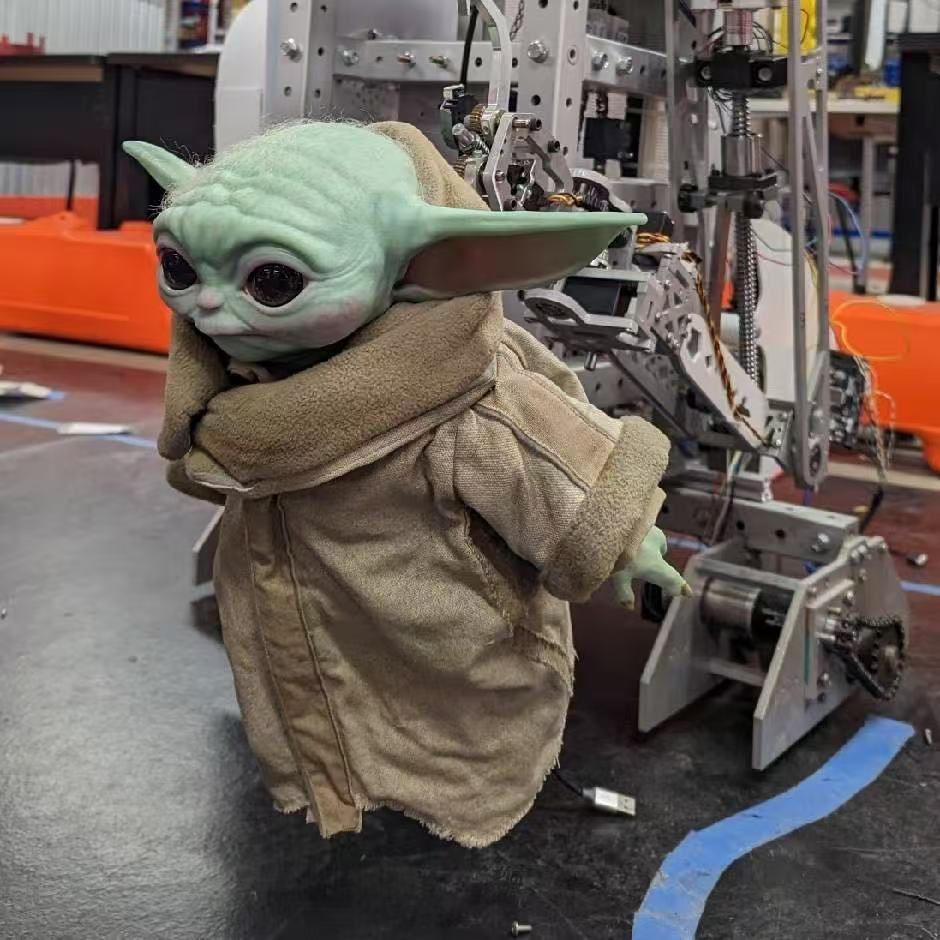
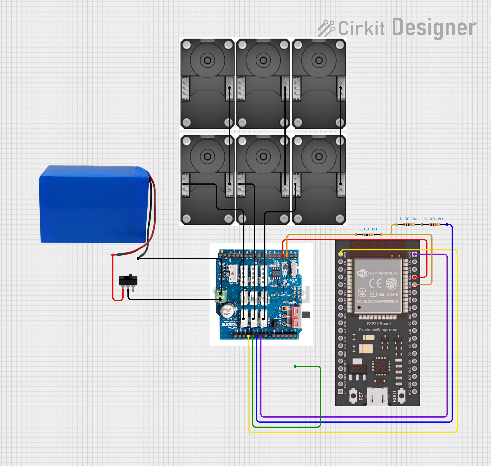
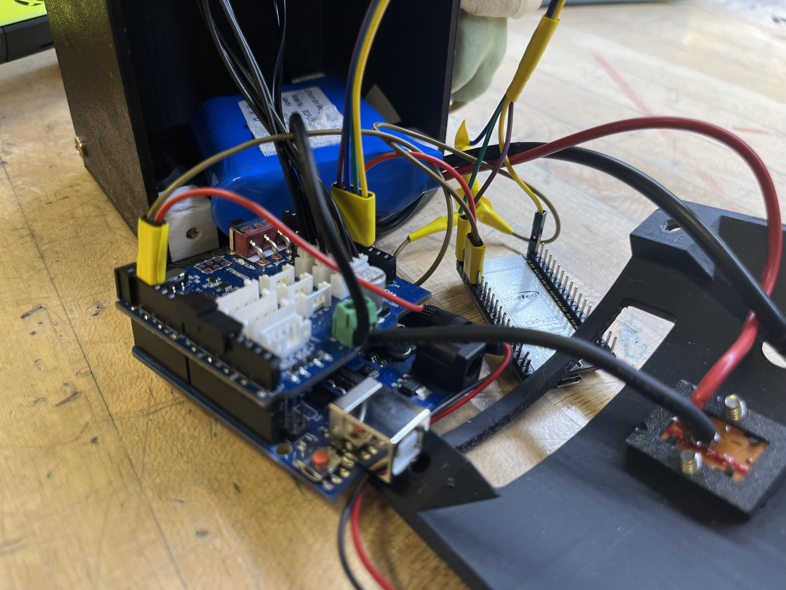

# Baby Yoda

These instructions will help you learn to control Baby Yoda, build your own Baby Yoda, and understand the current version with potential for expansion. Good luck!

**Control Version 1.1.0: Xbox to ESP32 to Arduino to Dynamixel - 03/15/2025**

Previous control version: Xbox to Laptop to HC-05 to Arduino to Dynamixel - 12/07/2024

This guide covers installation and motion testing: [Baby Yoda Install and Test](https://youtu.be/v0qp3fYCByA)

# User Instructions

### Control

Baby Yoda is controlled face-to-face, meaning when you push the left joystick, it moves the arm that's on your left (its right arm).

-   **Left Joystick**: Left Arm
-   **Right Joystick**: Right Arm
-   **D-pad**: Head
-   **X**: Shows a series of predefined motions
-   **Y**: Go to initial position
-   **B**: Wave left hand 3 times

### Power

Baby Yoda has two separate power systems that must both be on to function: Arduino (9V) and Dynamixel Shield (12V).

The switch controls the Dynamixel Shield's power. The rightmost charger connects to the Dynamixel Shield's internal battery.

The Arduino can be powered either through a 9V battery/power source or by connecting it to your computer via the USB-B port.

### Pairing

Press and hold the connection button on top of the Xbox controller until the flashing light becomes steady.

# For Developers

## Dynamixel

-   Each Dynamixel motor's ID is configured as follows (Left/Right are from a face-to-face perspective with Baby Yoda):
    -   Head motor (up-down): 101
    -   Neck motor (left-right): 102
    -   Left Arm motor (outward-inward): 103
    -   Left Shoulder motor (forward-backward): 104
    -   Right Shoulder motor (forward-backward): 105
    -   Right Arm motor (outward-inward): 106
-   To upload the code, set the Dynamixel shield switch to `upload` mode. For motor operation, switch it to `Dynamixel` mode.
-   If a motor becomes stuck, its LED will flash and it may lose torque. A power restart may be necessary.

## Circuit

Baby Yoda’s circuit diagram, created using [Cirkit Designer IDE](https://app.cirkitdesigner.com/project/733f7253-d2ce-4fde-950d-96555f7f8535).

A photo of the actual circuit connection.

### Arduino-ESP32 Communication

The ESP32 communicates with Arduino through TX-RX outputs, with ESP's TX port connected to Arduino's port 3 and RX port connected to Arduino's port 2. The baud rate is 9600, allowing direct serial port communication.

Since ESP32 operates at 3.3V while Arduino operates at 5V, we need a voltage divider using three resistors to adjust the voltage. The circuit ensures correct voltage output—without this adjustment, the readings would be corrupted.

The ESP32 receives power from the Arduino, with its 3.3V pin connected to Arduino's 3.3V port and its ground connected to Arduino's ground. You can verify that ESP32 is receiving power by checking if its red LED is illuminated.

### power source

The 12V battery connects directly to the Dynamixel shield's power input, with a switch installed on the positive terminal.

### Dynamixel Motors

The connection pattern of the Dynamixel motors doesn't matter, as long as they're all connected to the Dynamixel shield.

In this case, I connected them in pairs: the head motor and neck motor as one pair, the left arm and left shoulder as another pair, and the right arm and right shoulder as the third pair.

Each pair is connected in series and plugged into one of the three ports on the Dynamixel shield.

## Code

### Arduino Code ([`BabyYodaDynamixalCode.ino`](https://github.com/lllx125/BabyYoda/blob/main/BabyYodaDynamixalCode/BabyYodaDynamixalCode.ino))

-   **Degree Coordinate Transformation**:
    -   The code doesn't read degrees directly from the motor. Instead, it converts degrees into a custom coordinate system. This new system applies a shift (without scaling) to the motor degree, where the "initial degree" becomes 0 in our coordinate system.
    -   The degree shift can be adjusted by changing the initial position of the motor in the `initPosition()` function. The `initID()` function rotates the motor to its actual degree and sets that as our new 0.
    -   `initID()` ensures the motor returns to its initial position smoothly from the correct direction.
    -   When joints or motors are changed, the initial degrees must be recalibrated. **If Right Arm motor and Left Arm motor ever fell off the gear, the initial position will need to be changed!** Note that a stuck motor will not function.
    -   Press the Arduino's reset button to return to the initial position.
    -   The program tracks motor rotations and stores the degrees in `Degree`.
    -   Each motor has degree limits to prevent jamming. These limits are stored in `DegreeLimit` and verified by `assertDegree()`.
    -   While the gear ratio affects rotational speed, degree measurements still refer to the motor's angle.
-   **Control Mechanism**:
    -   The controller sends only two signals: a start signal when a button is pressed and a stop signal when it's released.
    -   When receiving a stop signal, the motor stops immediately.
    -   When receiving a start signal, the motor begins rotating at a predefined speed.
    -   To prevent damage, the motor must not move indefinitely without a stop signal. We must ensure that the motor's degree of rotation stays within defined limits.
    -   To accomplish this, we manually send a stop signal after a calculated interval following the start signal. This interval is calculated using the current degree and angular velocity.
    -   Here is the complete control process: start signal → set motor velocity → send a delayed stop signal timed to reach the limit → stop when receiving a signal (either from the controller or from reaching the limit).
-   **Specific Functions Explanations**:
    -   `rotateTo()`: rotates the motor to a specific degree at a set speed.
    -   `testMotions()`: makes Baby Yoda perform a predetermined sequence of movements.
    -   `control()`: receives instructions from the serial port and converts them to motor movements.
    -   `start()`: initiates motor movement at a specified speed. It checks if the movement is within allowed limits, calculates maximum run time, and sets a stop time. The motor automatically stops at the limit if no stop signal is received.
    -   `stop()`: halts the motor when called by a stop instruction or `checkStopTime()`.

### ESP32 Code ([`ESP32Code.ino`](https://github.com/lllx125/BabyYoda/blob/main/ESP32Code/ESP32Code.ino))

-   Reads gamepad status from the Xbox controller, organizes it, normalizes the joystick position, and stores it in the structure `RobotControllerState`.
-   `PosToState()` converts the gamepad joystick position into discrete states.
-   `buildCode()` monitors state changes. When a state changes, it writes instructions to send to the Arduino.
-   Uses serial communication to send the code to Arduino via a baud rate of 9600. See more details in the [Arduino-ESP32 Communication](#arduino-esp32-communication) section.

## **Materials**

-   Baby Yoda Model
-   Arduino Uno
-   ESP32
-   Dynamixel Shield
-   6 Dynamixel XC330 Motors
-   12V Rechargable Battery
-   Wires
-   1k resistors
-   Switch
-   Cable (for powering Arduino or sending code to Arduino) or 9V battery (for powering Arduino)
-   Xbox One Controller

# Debug Checklist

-   If a motor becomes loose, turn off the 12V power supply and turn it back on.
-   If pairing fails, try disconnecting and reconnecting the 9V battery. If the issue persists, the battery may need replacement.
-   If motors are misaligned, press Y to return to initial position or press the red reset button on the Arduino.
